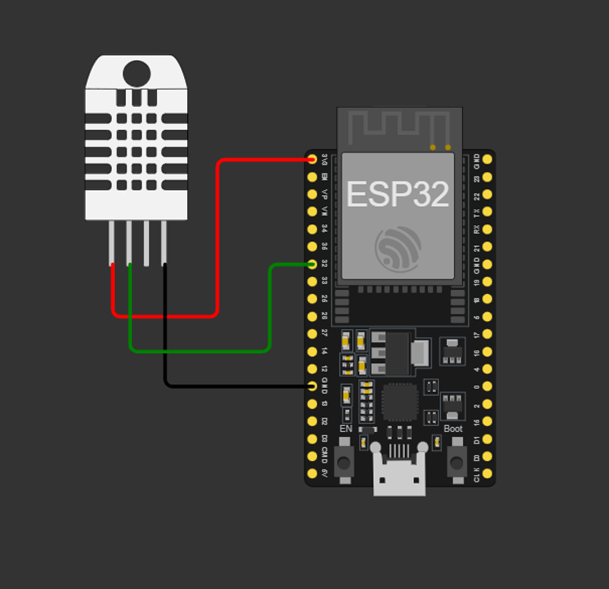
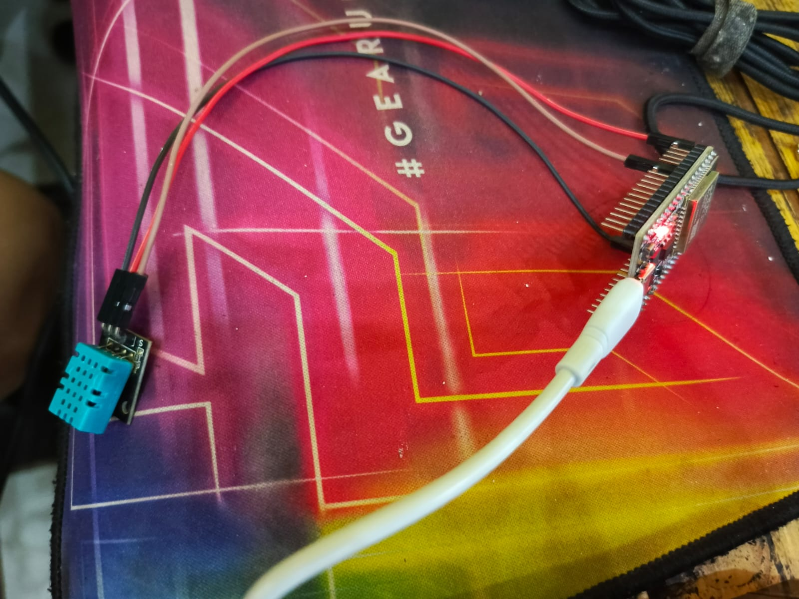

# 🌡️ Sistem Kontrol Kipas Berbasis Fuzzy (ESP32 + Blynk)

## 📌 Deskripsi Proyek
Proyek ini merupakan sistem **kontrol kecepatan kipas otomatis** berbasis **logika fuzzy ** menggunakan **ESP32**, **sensor DHT11**, dan **platform Blynk IoT**.

Sistem membaca **suhu** dan **kelembaban**, kemudian menentukan kondisi kipas:
- Kipas Mati
- Kipas Pelan
- Kipas Cepat

berdasarkan **aturan fuzzy (rule base)**.

---

## 🧠 Metode yang Digunakan
- **Logika Fuzzy **
- Inferensi menggunakan:
  - **AND → fungsi MIN**
  - **OR → fungsi MAX**
- Defuzzifikasi menggunakan:
  - **Weighted Average**

---

## 🔌 Perangkat yang Digunakan
- ESP32
- Sensor DHT11
- Aplikasi Blynk
- Arduino IDE

---

## 🔢 Variabel Fuzzy

### 1️⃣ Input Suhu (°C)
| Linguistik | Fungsi Keanggotaan  |
| ---------- | ------------------- |
| Dingin     | Turun (20–25)       |
| Normal     | Segitiga (24–28–32) |
| Panas      | Naik (30–36)        |

---

### 2️⃣ Input Kelembaban (%)
| Linguistik | Fungsi Keanggotaan  |
| ---------- | ------------------- |
| Kering     | Turun (40–50)       |
| Normal     | Segitiga (50–60–70) |
| Lembab     | Naik (65–80)        |

---

### 3️⃣ Output Kipas
| Output | Nilai Crisp |
| ------ | ----------- |
| Mati   | 0           |
| Pelan  | 50          |
| Cepat  | 100         |

---

## 📋 Tabel Rule Base Fuzzy 

| Rule | Suhu   | Kelembaban | Output Kipas |
| ---- | ------ | ---------- | ------------ |
| R1   | Dingin | —          | Mati         |
| R2   | Normal | —          | Pelan        |
| R3   | Panas  | Kering     | Pelan        |
| R4   | Panas  | Normal     | Cepat        |
| R5   | Panas  | Lembab     | Cepat        |

**Keterangan:**
- Tanda **—** berarti tidak bergantung pada variabel kelembaban
- Operator **AND** digunakan saat kondisi lebih dari satu
- Operator **OR** digunakan saat beberapa rule menghasilkan output yang sama

---

## ⚙️ Inferensi Fuzzy 

### 🔹 AND (Operator MIN)
Digunakan **di dalam satu rule**.

---
### 🖼️ Skema Alat

    

---

### 🖼️ Tampilan UI Blynk

    

**Keterangan Gambar:**
- Nilai suhu dan kelembaban ditampilkan secara real-time
- Status kipas berubah otomatis berdasarkan hasil inferensi fuzzy 
- Data diperbarui setiap 1 detik

### Hasil Alat

    

